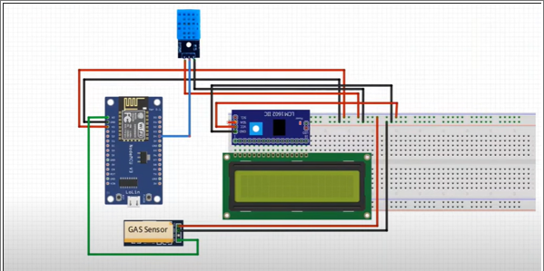
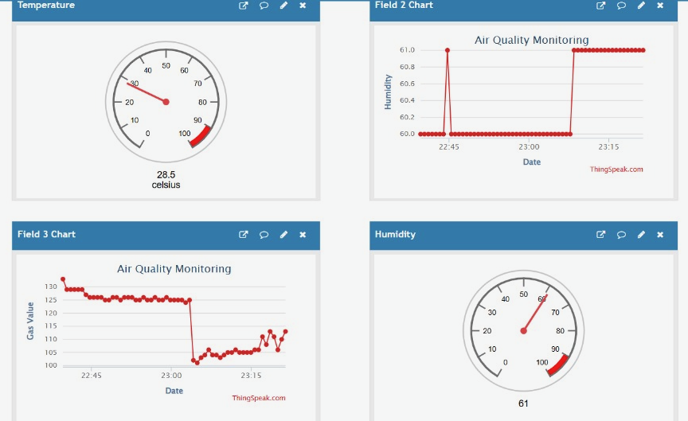

# IOT based Air Quality and Temperature Monitoring System

This documentation explains how to use the provided code to build and deploy an air quality monitoring system using ESP8266, DHT11 sensor, MQ gas sensor, and a 16x2 LCD. The system uploads temperature, humidity, and air quality data to ThingSpeak for remote monitoring.

## Features
- Reads temperature and humidity using the DHT11 sensor.
- Monitors air quality using an MQ gas sensor.
- Displays readings on a 16x2 LCD.
- Sends data to ThingSpeak for cloud-based monitoring.

## Requirements
### Hardware:
1. ESP8266 module (e.g., NodeMCU)
2. DHT11 temperature and humidity sensor
3. MQ gas sensor
4. 16x2 I2C LCD display
5. Resistors, connecting wires, and a breadboard
6. Power source for ESP8266

### Software:
1. Arduino IDE
2. Required libraries:
    i. ESP8266WiFi
    ii. ThingSpeak
    iii. DHT
    iv. LiquidCrystal_I2C

## Circuit Diagram


### Setup Instructions
1. Install Required Libraries:
Open the Arduino IDE and install the following libraries via Tools → Manage Libraries:
- ESP8266WiFi
- ThingSpeak
- DHT sensor library by Adafruit
- LiquidCrystal I2C

2. Connect the Hardware
- Connect the DHT11 sensor:
    - VCC → 3.3V (ESP8266)
    - GND → GND
    - DATA → GPIO 2 (D4 pin on NodeMCU)
- Connect the MQ gas sensor:
    - VCC → 3.3V (ESP8266)
    - GND → GND
    - OUT → Analog pin (A0)
- Connect the 16x2 I2C LCD:
    - VCC → 5V
    - GND → GND
    - SDA → GPIO 4 (D2)
    - SCL → GPIO 5 (D1)

3. Configure WiFi and ThingSpeak
Replace the following placeholders in the code:
```cpp
char ssid[] = "abc";        // Replace with your WiFi SSID
char pass[] = "12345678";   // Replace with your WiFi Password
unsigned long channelID = YOUR_CHANNEL_ID;  // Replace with your ThingSpeak Channel ID
const char *writeAPIKey = YOUR_API_KEY;     // Replace with your ThingSpeak API Key
```

4. Upload the Code
- Open the code in Arduino IDE.
- Select the correct board (NodeMCU 1.0 (ESP-12E Module)) and port under Tools.
- Click Upload.

### Usage
1. Power On the System:
- Connect the ESP8266 to a power source.
- Wait for the ESP8266 to connect to the WiFi. The serial monitor will show Connected to WiFi once successful.

2. Monitor Data:
- The LCD alternates between displaying:
    - Temperature in °C
    - Humidity in %
    - Gas value and air quality (e.g., "Fresh Air" or "Bad Air").
- Data is sent to ThingSpeak every 30 seconds. You can view the data on your ThingSpeak channel.

## ThinkSpeak Dashboard


### Key Components in Code
1. Sensor Readings:
- Temperature (t) and humidity (h) are obtained using the DHT11 sensor.
- Air quality is measured by reading the analog value from the MQ gas sensor.

2. LCD Display:
- Custom degree symbol for temperature.
- Alternates between temperature, humidity, and air quality status every 4 seconds.

3. ThingSpeak Integration:
- Updates fields for temperature, humidity, and gas values on ThingSpeak.
- Logs success or failure of data uploads via the serial monitor.

### Troubleshooting
1. WiFi Connection Issues:
- Ensure the correct SSID and password.
- Check your router's settings to confirm ESP8266 can connect.

2. Sensor Read Failures:
- Verify wiring and connections.
- Replace faulty sensors if necessary.

3. Data Not Showing on ThingSpeak:
- Check if the channel ID and API key are correct.
- Ensure the ESP8266 has internet access.

### Customization
1. Adjust Sampling Time: Modify the delay(30000); in the loop() to change the data upload frequency.
2. Additional Features
- Add alerts (e.g., buzzer or LED) for poor air quality.
- Use additional sensors for enhanced environmental monitoring.

This system is now ready for real-time air quality monitoring with data visualization on ThingSpeak!